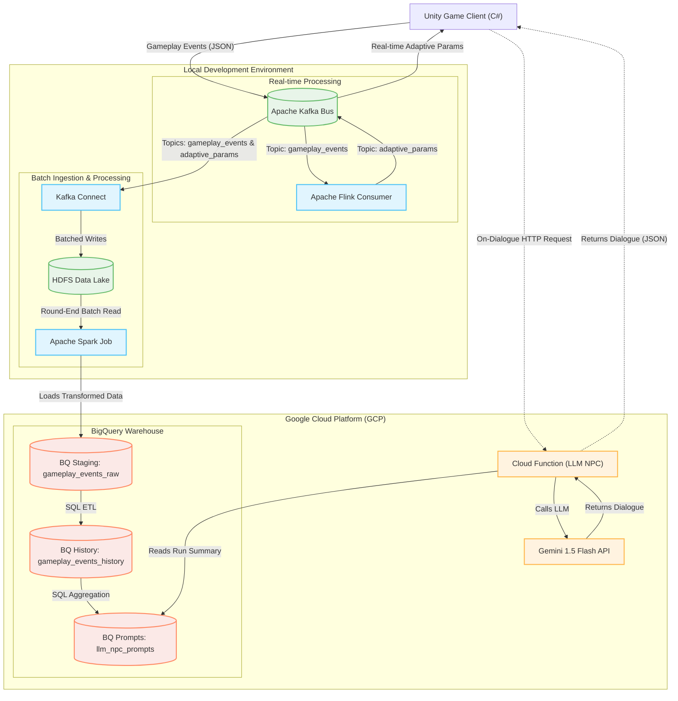

# AdaptiveSurvivors

A multiplayer survival game built with Unity and cloud backend.

## Prerequisites (for development)

- **Git**
- **Unity 6 LTS**
- **Docker Desktop**
- **Node.js v22.13.0 LTS**
- **JDK 8 LTS** [Adoptium link](https://adoptium.net/temurin/releases/?version=8&os=any&arch=any)
- **Maven 3.9.10** [Apache Maven link](https://maven.apache.org/download.cgi)

## Quick Start

### 1. Clone and Setup

The Unity dev environment is a submodule since it's pretty big.

```powershell
# Clone repository only
git clone https://github.com/DustinBS/AdaptiveSurvivors.git

# Initialize submodules (if you want the Unity project)
git submodule update --init --recursive
```

Or clone with submodules in one step:
```powershell
git clone --recurse-submodules https://github.com/DustinBS/AdaptiveSurvivors.git
```

### 2. Start Backend Services

```powershell
# Start all services
docker-compose up -d

# Verify services are running
docker-compose ps
```

### 3. Open Unity Project

You can direct Unity Hub to "Add" AdaptiveSurvivors/GameClient using Unity 6 LTS and it should work.

## Development Workflow

It's essentially just working with 1 git repo in another, e.g.

### Working with Unity (GameClient submodule)

```powershell
# Make changes in Unity, then:
cd GameClient
git add .
git commit -m "Your changes"
git push origin main

# Update parent repository reference
cd ..
git add GameClient
git commit -m "Update GameClient"
git push origin main
```

### Pull Latest Changes

```powershell
git pull origin main
git submodule update --recursive --remote
```

## Common Commands

```powershell
# Check submodule status
git submodule status

# Reset Docker environment
docker-compose down
docker-compose up -d
```

## Project Structure

```
AdaptiveSurvivors/
├── Backend/           # Docker containers
├── CloudFunctions/    # GCP Serverless functions
├── GameClient/        # Unity project (submodule)
└── docker-compose.yml, .env.example, other files
```

## Planned Architecture

