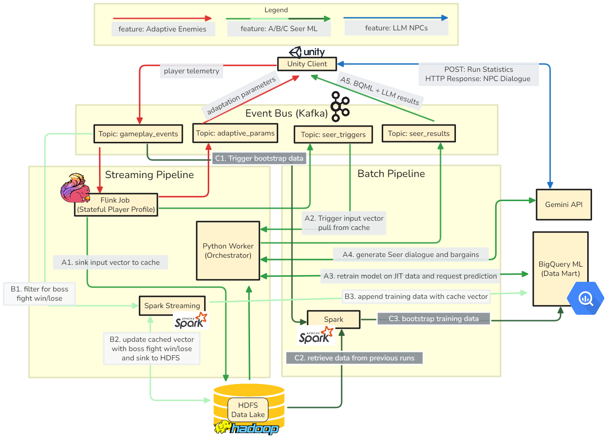

# AdaptiveSurvivors

An experimental survivors-like game built with Unity and cloud backend. The Apache data stack (Kafka, Spark, Flink) is deployed locally with Docker compose as a proof-of-concept, but it is built with a distributed flow in mind (i.e. resillience to higher latency). The idea is to enable tracking of player telemetry but offload potentially heavy processing of enemy behavior parameters to create the effect that the enemy is watching and adapting to the player (because they are) even when there are lots of enemies. No more major features are planned apart from visual or musical additions. Feel free to use the setup as a reference for your own project, though live-service games (like this would be in a real product) is very difficult to get right and be financially sustainable.   

## Prerequisites (for development)

- **Unity 6 LTS**
- **Docker Desktop**
- **JDK 8 LTS** - (for Flink, Scala) [Adoptium JDK 8 downloads page](https://adoptium.net/temurin/releases/?version=8&os=any&arch=any)
- **Maven 3.9.10** - (for Flink, Scala) [Apache Maven downloads page](https://maven.apache.org/download.cgi)
- **Node.js v22.13.0 LTS** (for Unity -> LLM generation of certain dialogue)
- **Terraform (+ gcloud)** - (Optional for GCP, otherwise use [console.cloud.google.com](https://console.cloud.google.com))
- **Powershell** (Optional for .ps1 backend setup scripts at root, you can easily translate them to Bash)
- **Git**

## Planned Architecture


## Quick Start

### 1. Clone and Setup

The Unity dev environment is a submodule since it's pretty big.

```powershell
# Clone repository only
git clone https://github.com/DustinBS/AdaptiveSurvivors.git

# Initialize submodules (if you want the Unity project)
git submodule update --init --recursive
```

Or clone with submodules in one step:
```powershell
git clone --recurse-submodules https://github.com/DustinBS/AdaptiveSurvivors.git
```

### 2. Start Backend Services

Set the .env variables and terraform.tfvars.example if you want to test the cloud features using terraform.

Run `terraform apply` before `start_backend.ps1` because the service `seer-orchestartor` mounts the key.

```powershell
# Start all services
terraform -chdir="Terraform" init
terraform -chdir="Terraform" apply
start_backend.ps1

# Verify services are running
docker compose ps
```

note: the `terraform` setup manages the lifecycle of the key, so this next step won't necessary if you are using it.
After you provision GCP services, run `generate-gcp-key.ps1` on project root to get your service account key to gcp-credentials/service-account-key.json for Spark.
Alternatively, run the commands yourself
```powershell
# The format is [SERVICE_ACCOUNT_NAME]@[PROJECT_ID].iam.gserviceaccount.com
# If you dont know your service account, you can find it with gcloud
gcloud iam service-accounts list
# or gcloud iam service-accounts list --project PROJECT_ID
gcloud iam service-accounts keys create "gcp-credentials/service-account-key.json" `
  --iam-account=[SERVICE_ACCOUNT_NAME]@[PROJECT_ID].iam.gserviceaccount.com
```

### 3. Open Unity Project

You can direct Unity Hub to "Add" AdaptiveSurvivors/GameClient using Unity 6 LTS and it should work.

## Development Workflow

It's essentially just working with 1 git repo in another, e.g.

### Working with Unity (GameClient submodule)

```powershell
# Make changes in Unity, then:
cd GameClient
git add .
git commit -m "Your changes"
git push origin main

# Update parent repository reference
cd ..
git add GameClient
git commit -m "Update GameClient"
git push origin main
```

### Pull Latest Changes

```powershell
git pull origin main
git submodule update --recursive --remote
```

## Common Commands

```powershell
# Check submodule status
git submodule status

# Reset Docker environment
docker-compose down
docker-compose up -d
```

## Project Structure

```
AdaptiveSurvivors/
├── Backend/           # Docker containers
├── CloudFunctions/    # GCP Serverless functions
├── GameClient/        # Unity project (submodule)
└── docker-compose.yml, .env.example, other files
```
